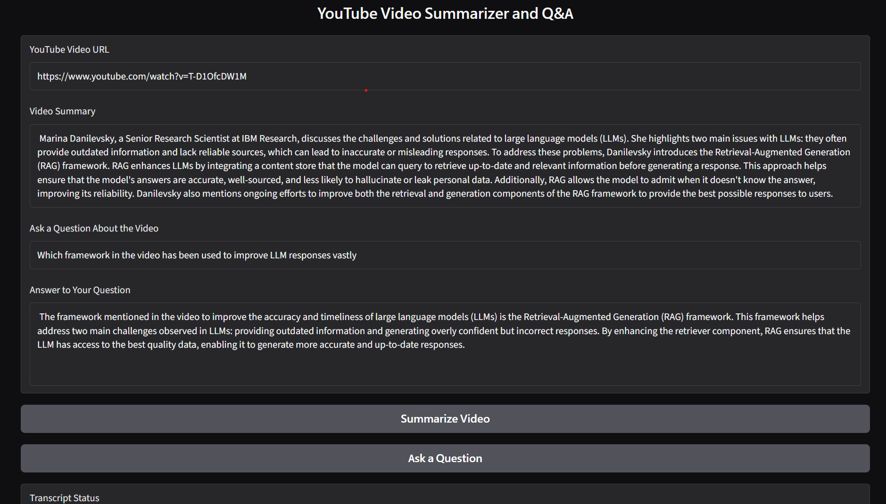

# YouTube Video Summarizer & Q&A Bot

An AI-powered YouTube video assistant that extracts English transcripts from YouTube videos, processes the transcript into manageable chunks, creates vector embeddings, and uses IBM watsonx AI models to generate summaries and answer questions about the video content.

## Demo

The application provides a Gradio-based interface where users can enter a YouTube video URL, generate a summary, and ask questions about the video's content.



## Overview

This project combines YouTube transcript extraction, LangChain, FAISS, and IBM watsonx AI to create a retrieval-augmented question-answering workflow for YouTube videos.

The application follows this general pipeline:

```text
YouTube Video URL
       ↓
Extract YouTube Video ID
       ↓
Retrieve English Transcript
       ↓
Process Transcript
       ↓
Split Transcript into Chunks
       ↓
Generate Embeddings
       ↓
Create FAISS Vector Index
       ↓
Retrieve Relevant Video Context
       ↓
IBM watsonx LLM
       ↓
Summary / Question Answer
```

## Features

* Extracts the YouTube video ID from a YouTube URL.
* Retrieves available English transcripts.
* Prioritizes manually created English transcripts over automatically generated ones.
* Processes transcript entries into text with timestamps.
* Splits long transcripts into smaller chunks using LangChain's `RecursiveCharacterTextSplitter`.
* Converts transcript chunks into embeddings using IBM watsonx.
* Stores embeddings in a FAISS vector index.
* Performs similarity search to retrieve relevant portions of the transcript.
* Uses prompt templates to generate summaries and answer questions.
* Provides an interactive interface using Gradio.

## Technologies Used

* **Python 3.11**
* **Gradio** — interactive web interface
* **YouTube Transcript API** — transcript extraction
* **LangChain** — text splitting, prompts, and LLM chains
* **FAISS** — vector storage and similarity search
* **IBM watsonx.ai** — LLM and embedding models

## Models

The original course code used older IBM model IDs that may no longer be supported in some watsonx environments.

For the current Skills Network environment, the LLM can be configured as:

```python
model_id = "ibm/granite-4-h-small"
```

and the embedding model can be configured as:

```python
model_id = "ibm/granite-embedding-278m-multilingual"
```

These model IDs depend on the models available in the IBM watsonx environment being used.

## Installation

### 1. Clone the repository

```bash
git clone https://github.com/YOUR_USERNAME/youtube-video-summarizer.git
cd youtube-video-summarizer
```

### 2. Create a virtual environment

Using `virtualenv`:

```bash
pip install virtualenv
virtualenv my_env
```

Activate it on Linux/macOS:

```bash
source my_env/bin/activate
```

On Windows:

```bash
my_env\Scripts\activate
```

### 3. Install dependencies

```bash
pip install -r requirements.txt
```

## IBM watsonx Configuration

The application requires access to IBM watsonx AI.

The project uses an IBM watsonx service URL and project ID to initialize the models.

For local development, credentials should be provided securely through environment variables or another secure configuration method.

**Do not commit API keys, access tokens, passwords, or other credentials to GitHub.**

## Running the Application

After installing the dependencies and configuring IBM watsonx:

```bash
python ytbot.py
```

The Gradio application will provide a local web interface.

A typical local address is:

```text
http://127.0.0.1:7860
```

## How It Works

### 1. YouTube URL Processing

The application extracts the 11-character YouTube video ID from a standard YouTube watch URL.

### 2. Transcript Extraction

The application searches for available English transcripts.

If both manually created and automatically generated English transcripts are available, the manually created transcript is preferred.

### 3. Transcript Processing

Transcript entries are converted into a formatted text representation containing the spoken text and its starting timestamp.

### 4. Text Chunking

Long transcripts are divided into smaller overlapping chunks using:

```python
RecursiveCharacterTextSplitter
```

This makes the transcript easier to process and retrieve efficiently.

### 5. Embeddings and FAISS

Each transcript chunk is converted into a numerical vector representation using an IBM watsonx embedding model.

The vectors are stored in a FAISS index.

When a user asks a question, the question is also used to search the index for the most relevant transcript chunks.

### 6. Retrieval-Augmented Question Answering

The most relevant transcript chunks are retrieved and supplied as context to the language model.

The LLM then generates an answer based on the retrieved video content.

## Project Structure

```text
youtube-video-summarizer/
│
├── ytbot.py
├── requirements.txt
├── README.md
└── .gitignore
```

## Current Limitations

* The transcript extraction logic currently focuses on English transcripts.
* The YouTube URL parser is designed around the standard `youtube.com/watch?v=` URL format.
* The application depends on the models available in the configured IBM watsonx environment.
* IBM watsonx credentials are required for LLM and embedding operations.
* Model availability can change between IBM watsonx environments and over time.

## Future Improvements

Possible future improvements include:

* Support for additional YouTube URL formats.
* Support for transcripts in additional languages.
* Improved error handling for videos without transcripts.
* More advanced summarization strategies for very long videos.
* Persistent vector storage.
* Support for additional LLM providers.
* Deployment as a publicly accessible web application.
* Improved UI and user experience.
* Secure environment-based configuration for API credentials.

## Learning Purpose

This project was developed as part of hands-on AI/LLM learning and demonstrates how multiple components can be combined to build a practical AI application.

It provides experience with:

* Python
* APIs
* YouTube transcript extraction
* LangChain
* Embeddings
* Vector databases
* FAISS
* Retrieval-augmented generation (RAG)
* Prompt engineering
* IBM watsonx AI
* Gradio

## License

This project is intended primarily for educational and portfolio purposes.
